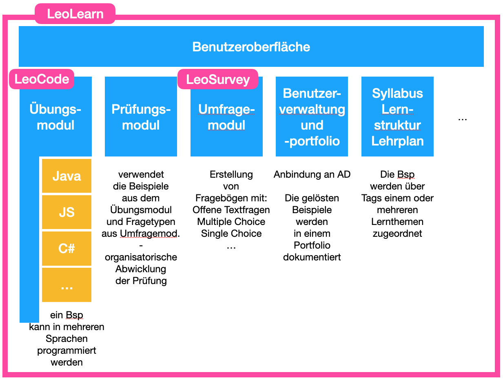

# LeoLearn

* https://htl-leonding-college.github.io/leo-learn-master

Ein System für den einfachen Einstieg in das Programmieren für die HTL Leonding 

## Diplomarbeit LeoCode 2021

Zum Lernen von Java

* Autor: Christian Donnabauer
* Jahr: 2020/21

